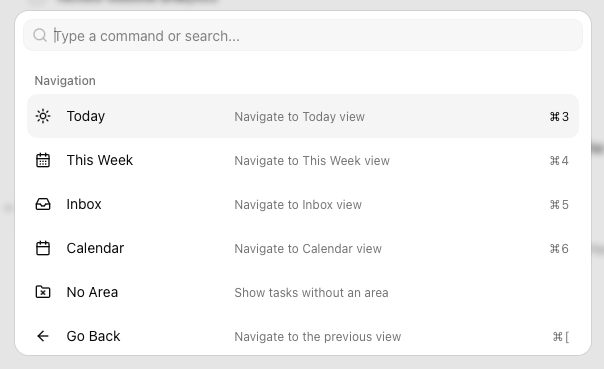
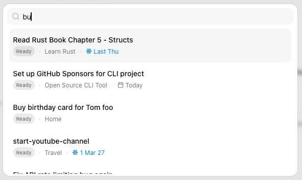

import { Kbd } from 'starlight-kbd/components'
import Center from '@components/Center.astro'

The command palette provides fast keyboard-driven access to all app functionality. Open it with <Kbd mac="Command+K" windows="Control+K" /> and just start typing.

Some commands will only be available in certain views or with a task selected, but the majority will always show up. This is often the fastest way to switch between views or open a specific project. It's also a good place to learn about the keyboard shortcuts available.

## Task Search

The command palette includes your areas and projects because they represent *Views*, but doesn't let you search for tasks. You can do this with <Kbd mac="Command+P" windows="Control+P" />, which lets you quickly find a task by `title` or filename. Recently updated tasks are shown first in the results and completed and dropped tasks are aways shown last. Pressing <Kbd mac="Enter" windows="Enter" /> will open the task in the [task details panel](/desktop/task-details-panel) and switch to the most appropriate view in the main window.

