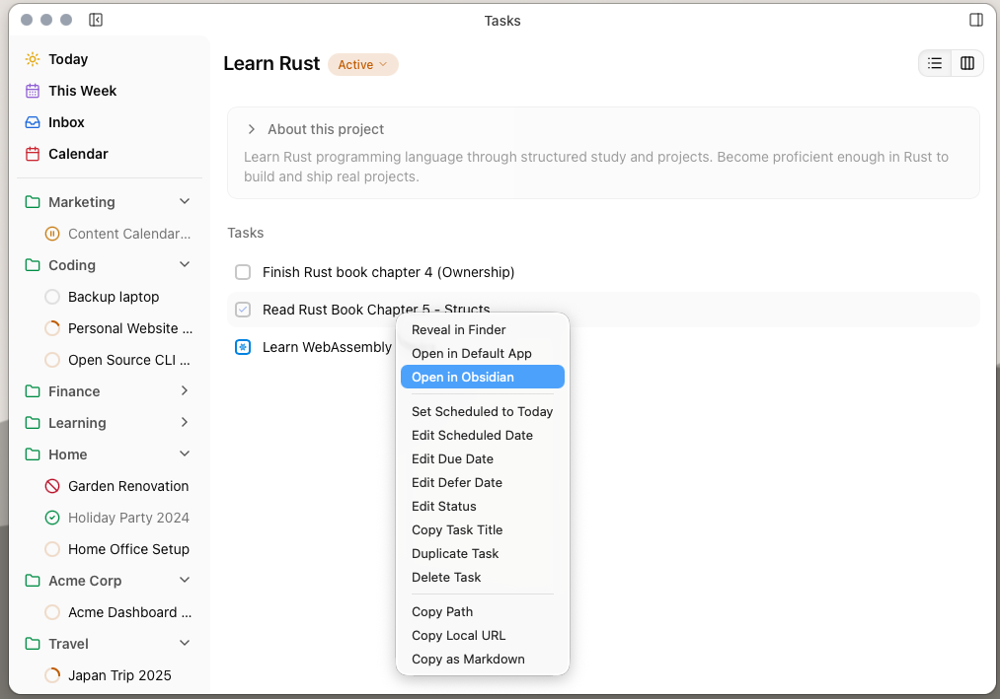

import { LinkCard } from '@astrojs/starlight/components'
import UnderConstruction from '@components/UnderConstruction.astro'

Right-clicking on a task, project or area exposes a range of options in a context menu, some of which are *only* available via the menu system and [command palette](/desktop/command-palette/).

[Insert table of context menu items with "name", "available: always | area | project | task", "description"]

## Keyboard Shortcuts

[Insert list of shortcuts as table with "shortcut" "available" "description" columns]

For a complete list of keyboard shortcuts, see the reference:

<LinkCard
  title="Keyboard Shortcuts Reference"
  href="/reference/desktop-reference/keyboard-shortcuts"
  description="Complete list of all keyboard shortcuts"
/>
