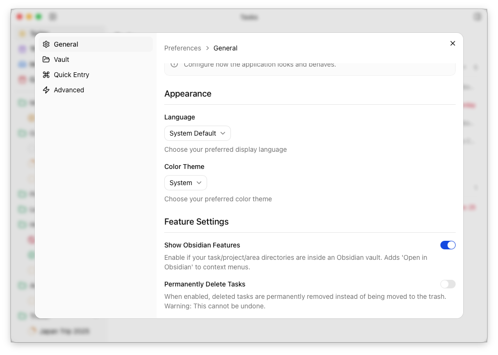
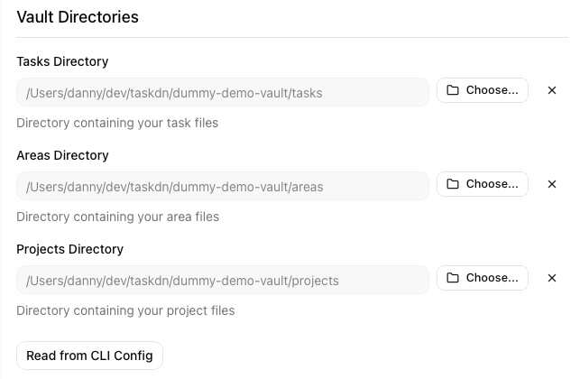
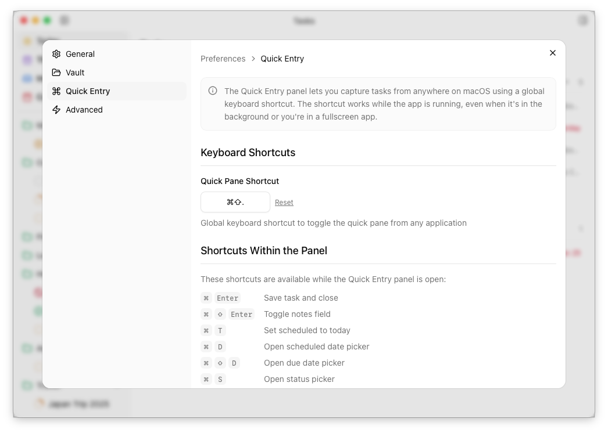

import { Aside } from '@astrojs/starlight/components'
import Center from '@components/Center.astro'

You can open the preferences from the **File** menu or the [command palette](/desktop/command-palette/). It contains a number of panes.

## General

In addition to your theme and language preferences, you can also configure the following global preferences:

1. **Show Obsidian Features** – Controls whether features like *Open in Obsidian* are shown in the UI.
2. **Permanently Delete Tasks** - By default, tasks deleted via the desktop app are moved to the system recycle bin/trash can. With this switch enabled, they will instead be permanently deleted.

## Vault

The **vault** pane contains settings related to your on-disk files. For the application to work, you must provide paths to the directories containing your areas, projects and tasks.

<Aside type="tip">
If you have the [CLI](/cli/overview) installed and configured via a `~/.taskdn.json` file, you can click <strong>Read from CLI Config</strong> to import your settings from there.
</Aside>

If any of these directories contain files which should be ignored (eg. `tasks/README.md`), you can also configure that here.

## Quick Entry Pane

Settings for the quick entry pane. You can change your global keyboard shortcut here.

## How your settings are stored

Your settings are persisted to disk in a `preferences.json`. The location of this differs depending on your operating system, but you can find it via the **Advanced** pane in the preferences.
