import { Aside } from '@astrojs/starlight/components'
import Center from '@components/Center.astro'

The desktop app provides several views for working with your tasks, each designed for a specific type of work. Before we get into them, let's look at the left sidebar

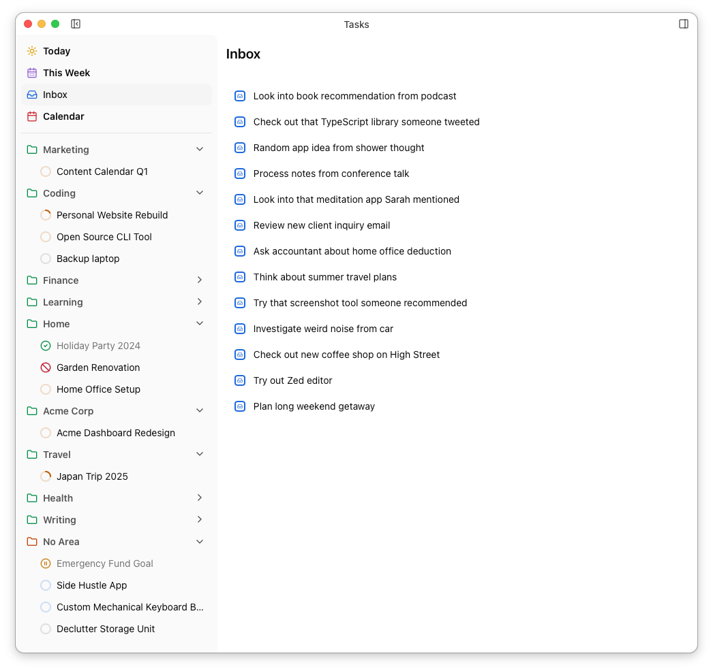

The top part of the sidebar contains the main views. Your areas are shown below as collapsible "folders" containing their projects. The final "area" is always *No Area* and contains your area-less projects and any tasks which have neither a project or area set.

<Aside type="tip">
You can drag your projects and areas into any order you want. Just be aware that dragging a project from one area to another will update it's `area` field.
</Aside>

Each project's status is shown by an indicator in the sidebar. *Active*, *Ready* and *Planning* projects have a progress indicator which shows how many of their tasks have been completed.

| Status | Color | Indicator |
| ------ | ----- | --------- |
| Planning | Blue | Progress indicator |
| Ready | Grey | Progress indicator |
| Active | Amber | Progress indicator |
| Blocked | Red | 🚫 |
| Paused | Orange | ⏸️ |
| Done | Blue | ✅ |

Clicking an item in the sidebar shows the appropriate view in the main window...

## Today ☀️

The Today view is your working daily task list. The **Scheduled for Today** section contains everything you've scheduled for today. Below that there are collapsible sections showing **Overdue or Due Today** (uncompleted tasks with a due date of today or earlier) and **Became Available Today** (uncompleted tasks with a `defer-until` date of today).

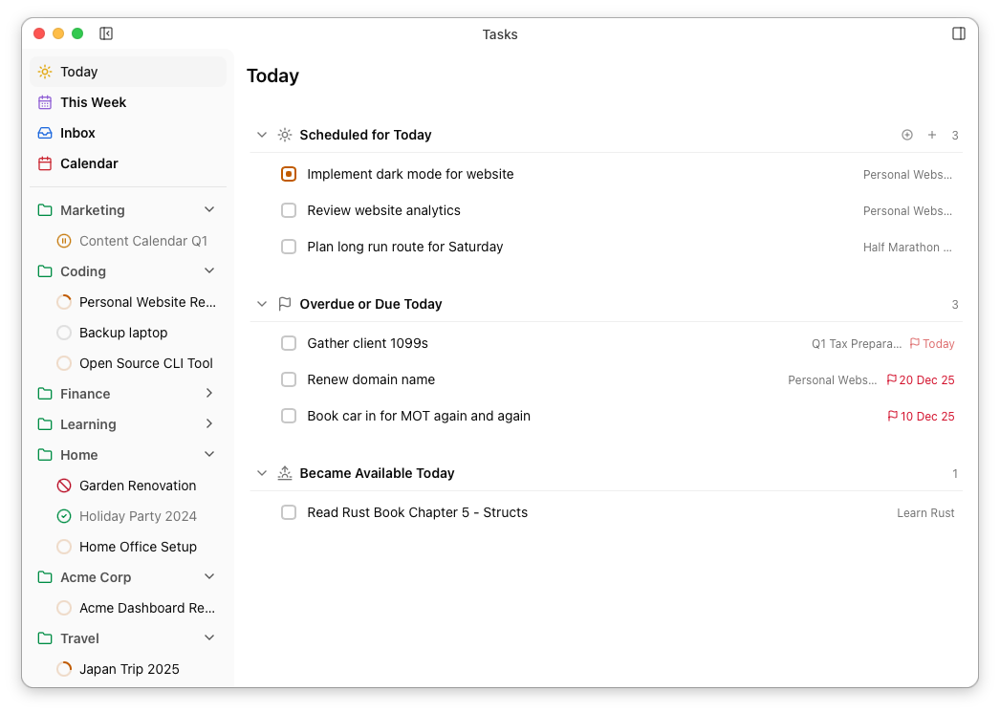

The last two sections exclude tasks which are scheduled for today, so dragging a task into *Scheduled for Today* will set it's scheduled date and "remove" it from the other sections.

You can reorder the tasks in *Scheduled for Today*. You can also add temporary headings to help with planning your day.

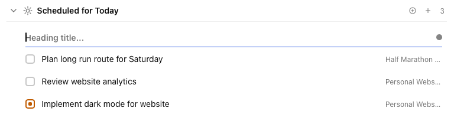

Headings have a name and colour, and can be reordered with in *Scheduled for Today* in a similar way to tasks. **Headings are purely presentational** – they have no affect on your task files or any other part of the desktop UI. Here's an example of a *Today* view using three headings, where all overdue and newly-available tasks have been moved (ie. scheduled) for today.

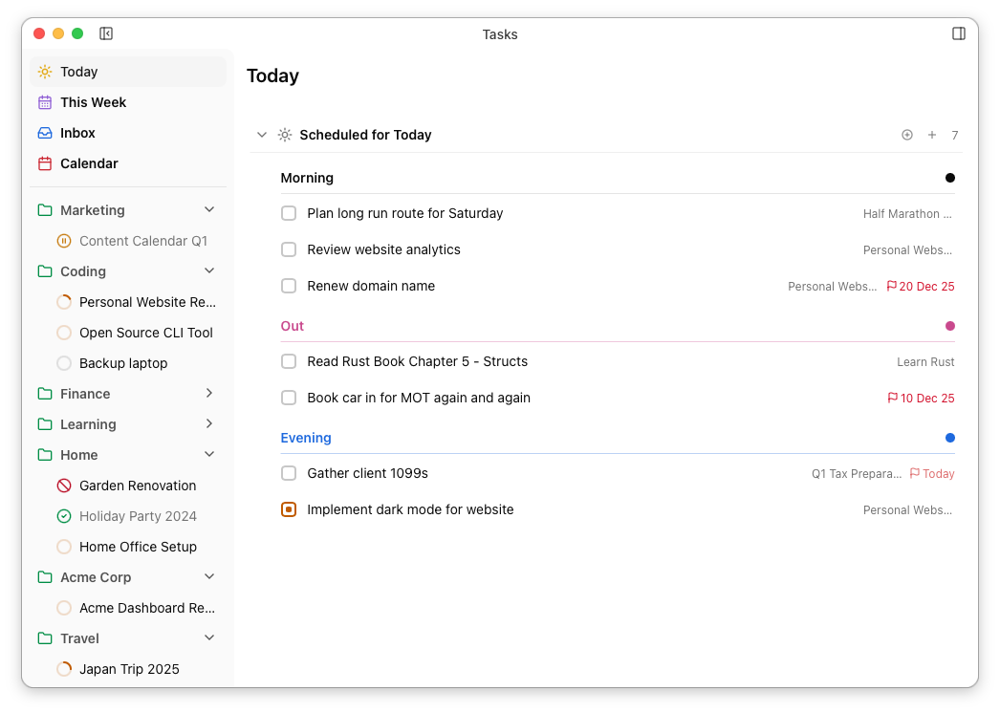

<Aside type="tip">
A common morning workflow involves:
1. Dragging due/overdue tasks into *Scheduled for Today*.
2. Reviewing and any newly available tasks and dragging them into *Scheduled for Today* if you want to address them now.
3. Quickly adding any other tasks you know you need to do today.
4. Organising *Scheduled for Today* by reordering your tasks and adding headings as needed.
</Aside>

## This Week 🗓️

The **This Week** view is intended for short-term planning. It shows the current week in a calendar view, with tasks displayed as cards.

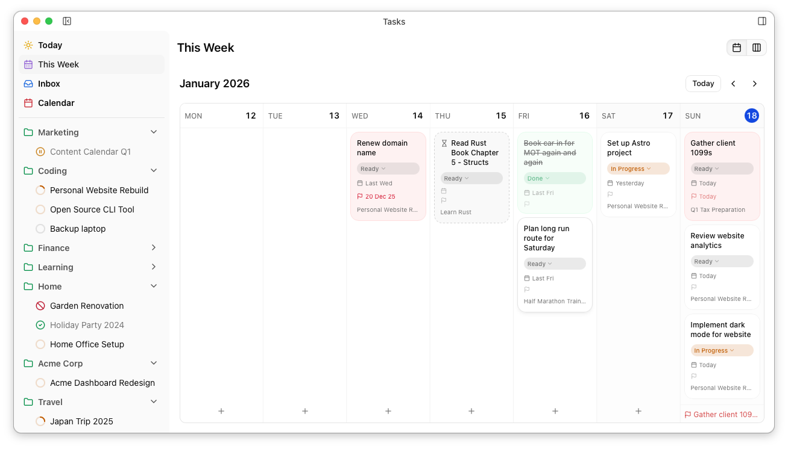

1. The calendar shows tasks with a **scheduled** date, and dragging a task between days sets it's **scheduled** date.
2. The only unscheduled tasks shown as cards are those with a **defer until** date and *no scheduled date*, which are shown with a dotted border. Dragging one of these will set it's scheduled date and cause it to behave like any other task in this view.
3. The calendar shows **due** tasks at the bottom of each day regardless of if/when they are scheduled. This helps to make hard deadlines visible when planning while ensuring this view only shows your actual plan for the week.

Your *This Week* view also includes a Kanban board showing all tasks scheduled for this week by status, which can be helpful when you want a general overview of the week's progress.

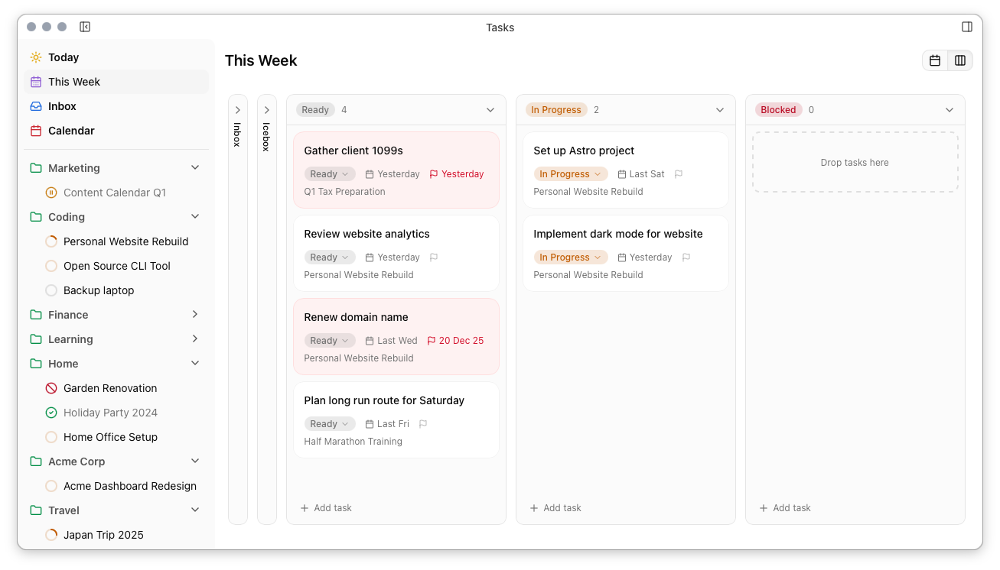

## Inbox 📥

The Inbox view shows all tasks with status `inbox`. This is a simple list view intended to make processing new tasks easy.

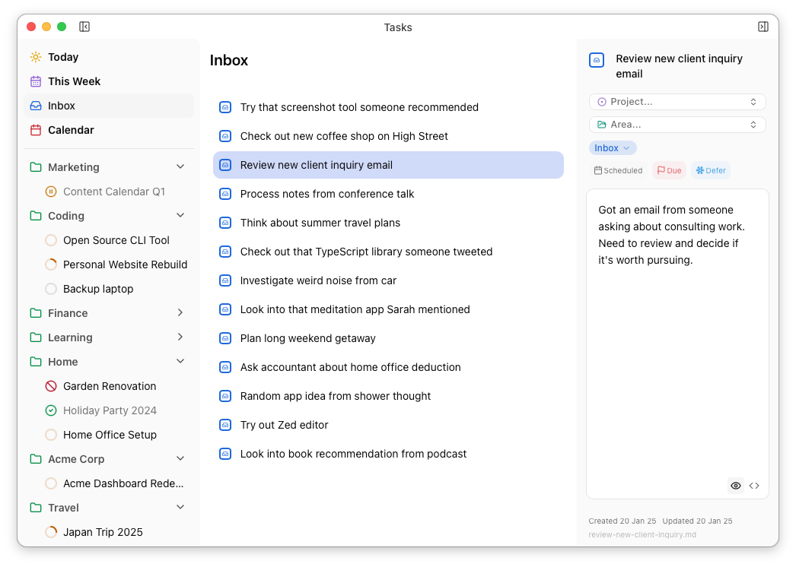

## Calendar 📅

The Calendar view is similar to the *This Week* view, but for longer-term planning and scheduling, and generally behaves in the same way. Only scheduled and defer-until tasks are shown and dragging a task always updates it's scheduled date.

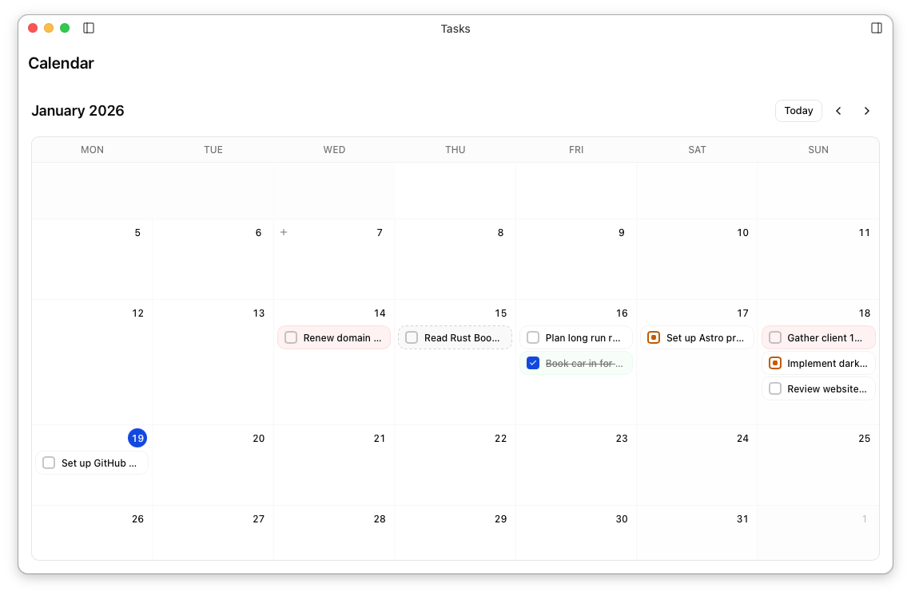

## Project View ⚪

Selecting a project in the left sidebar shows it's project view. The project's status can be changed in the header, and the body of the project document is available for reference in the expandable section at the top. The project's tasks are shown below.

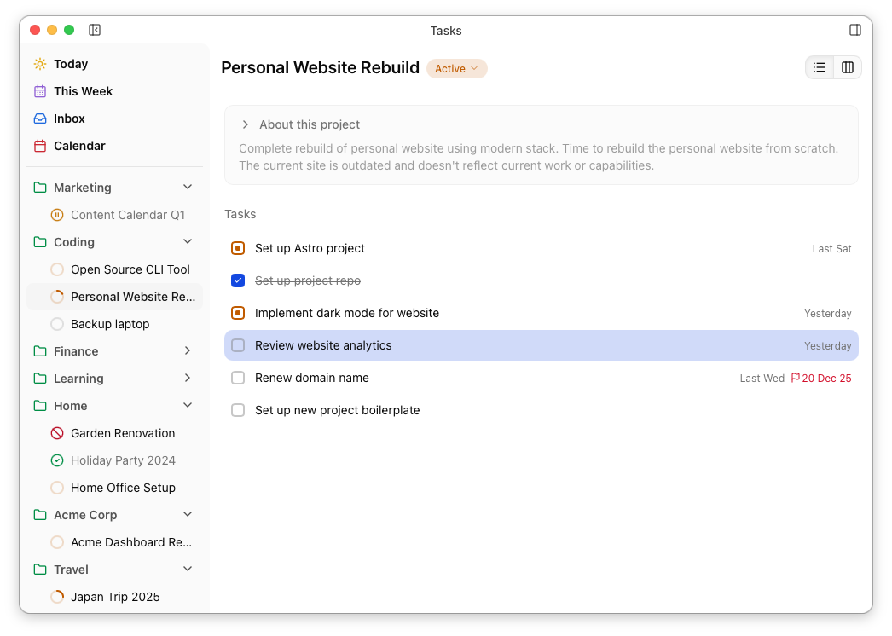

You can also view the project's tasks in a kanban board...

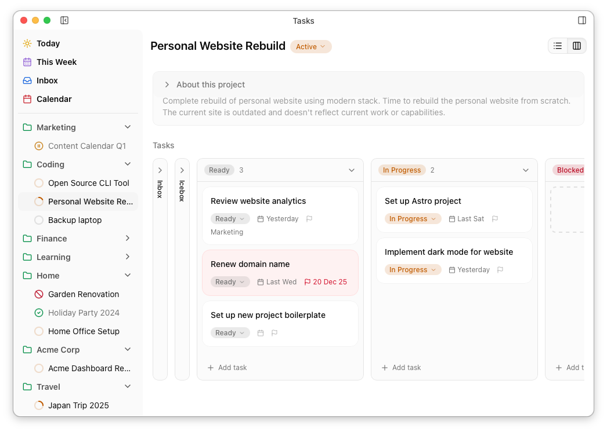

## Area View 📁

In a similar way, selecting an Area in the left sidebar shows it's area view. The body of the area file is shown in the expandable section at the top and its **active** projects are shown as cards below.

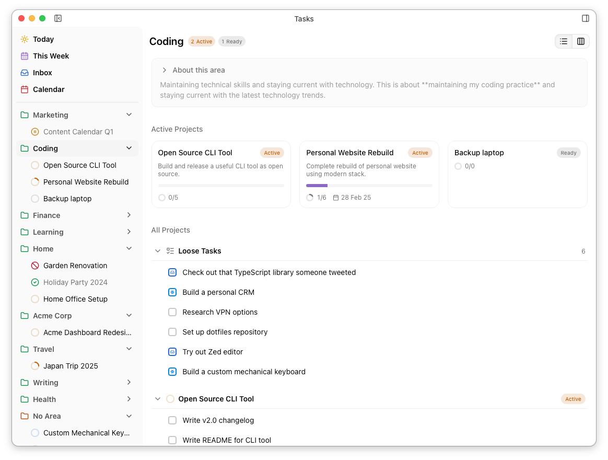

The **Loose Tasks** section shows all tasks which belong to the area but don't have a project. The sections below show the areas active projects and their tasks.

Dragging a task from one project to another (or to/from the *Loose Tasks* section) will update the task's `area` field.

As with projects, areas also have a kanban board...

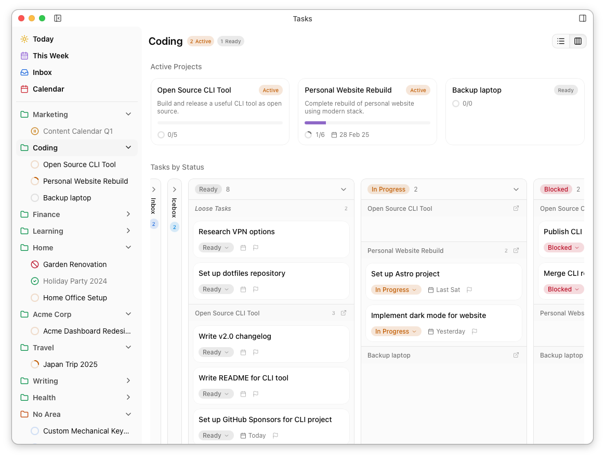

### The _No Area_ View

The No Area view works exactly like any other Area, except that it shows projects without an assigned area, and its *Loose tasks* section shows any tasks with neither area nor project.
