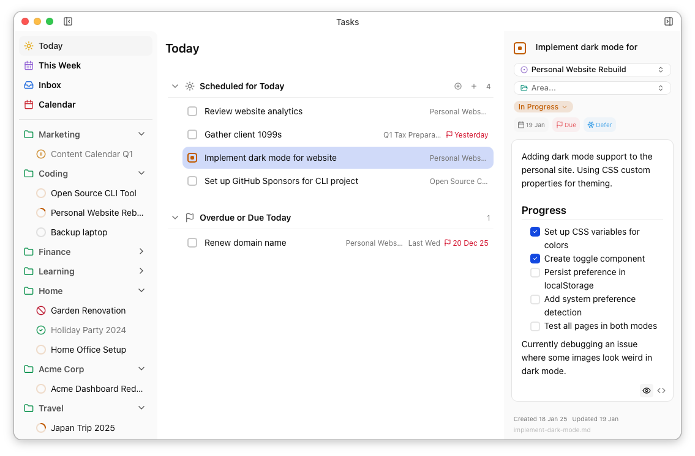
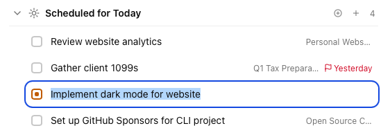

import { Kbd } from 'starlight-kbd/components'
import Center from '@components/Center.astro'

You've probably noticed that all [the views](/desktop/views/) have two main ways of displaying tasks: cards and lists. Cards are used in calendars & kanban boards and lists are used everywhere else. Let's look at lists in a bit more detail...

You can select a task by clicking on it or using the up/down keys. The currently selected task will have a blue background and will always be loaded in the [task details panel](/desktop/task-details-panel/).

You can edit a task's title by double-clicking or pressing Enter while it's selected. Confirm your edit by clicking somewhere else or pressing enter again, or cancel with Escape.

You can quickly reorder the task and edit other fields with the [keyboard shortcuts and right-click menu](desktop/menus-and-shortcuts/). The task's status is shown in the checkbox, and clicking it will toggle between *ready* and *done*.

## Creating Tasks

Pressing <Kbd mac="Command+N" windows="Control+N" /> with a task selected will insert a new task immediately below the selected one. Pressing enter or clicking away will save the task while <Kbd mac="Esc" windows="Esc" /> will remove it.

If no task is selected, the behaviour of <Kbd mac="Command+N" windows="Control+N" /> will depend on context: it will usually create a new task at the end of the most appropriate list. In the *Today* view, you'll get a "loose task" at the end of *Scheduled for Today*. In a project or area view it'll add a task to the appropriate project or area. Etc.

## Deleting Tasks

You can delete the selected task with <Kbd mac="Command+Backspace" windows="Control+Backspace" />. This will move the task file to your OS Recycle Bin/Trash Can (unless you have enabled permanent deletion in the preferences).
